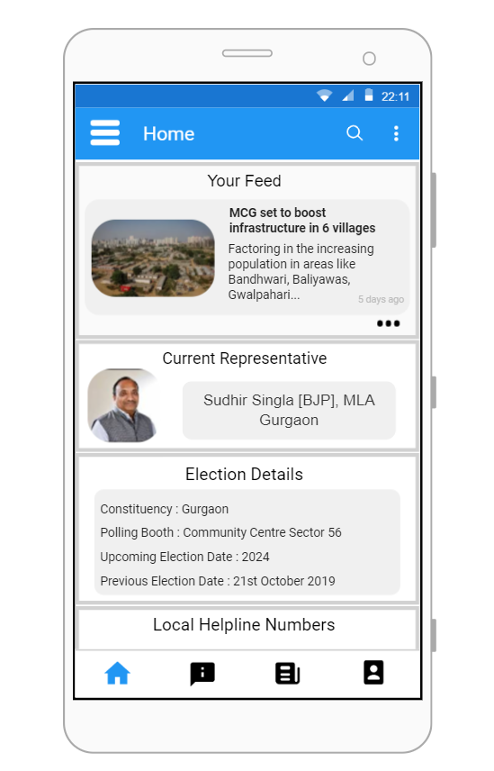

# Vriddhi
> The perfect local E-Governance solution

Separate feed that provides details about the local leaders and politicians and is updated regularly \
A dedicated grievance section for the public to voice their problems, and for the leaders to hear them. \
A dedicated panel with all the relevant helpline numbers that the people can use in case of emergencies. 

## Usage example
Got trouble with your stret lights, or maybe potholes inyour society, fear not we at Vriddhi got your back.\
You could register complanits on the app. \
Get to know your local leaders/represenatatives. \
One stop solution for all your local governance needs.

## Contributors

Shubham Gore \
Rakesh Venkat \
Shaswat Srivastava \
Yuvraj Chibber \
Manan Bhasin \
Dushyant Betala 

<!-- Markdown link & img dfn's -->
[npm-image]: https://img.shields.io/npm/v/datadog-metrics.svg?style=flat-square
[npm-url]: https://npmjs.org/package/datadog-metrics
[npm-downloads]: https://img.shields.io/npm/dm/datadog-metrics.svg?style=flat-square
[travis-image]: https://img.shields.io/travis/dbader/node-datadog-metrics/master.svg?style=flat-square
[travis-url]: https://travis-ci.org/dbader/node-datadog-metrics
[wiki]: https://github.com/yourname/yourproject/wiki
